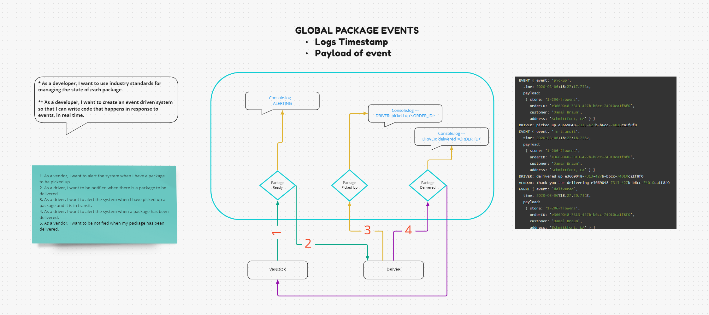

# LAB - Class 11, 12, 13

## Project: Code Academy Parcel Service (CAPS)

### Author: Tim Traylor

### Problem Domain

A real-time service that allows for vendors, such as flower shops or restaurants, to alert a system of a package needing to be delivered, for drivers to instantly see what’s in their pickup queue, and then to alert the vendors as to the state of the deliveries (in transit, and then delivered).

- [CI/CD GitHub Actions](https://github.com/TTraylor310/caps/actions)

#### Running the app

`node server.js` will start the server to listen
`node driverHub/driverHub.js` will start the driver module to listen
`node vendor/vendorHub.js` will start the orders and the flow of information

#### UML Diagram

Diagram created with [MIRO](https://www.miro.com/)

#### Credits: Code reviews in the morning
